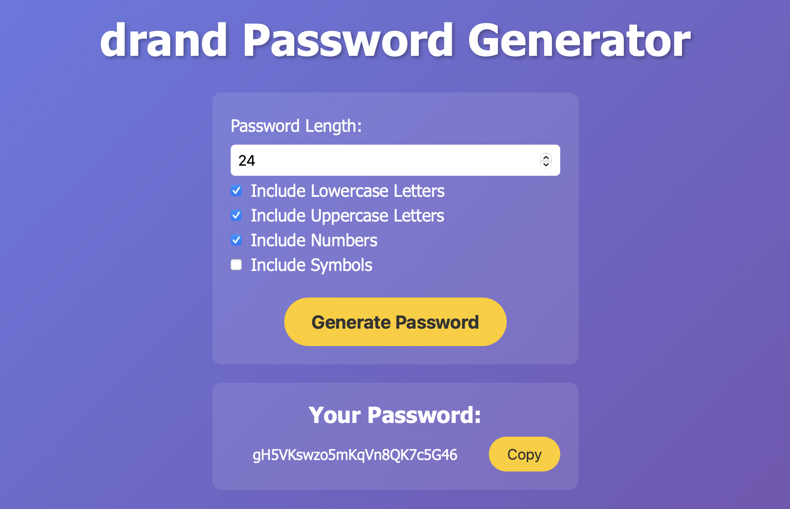

# drand-passgen

[](https://github.com/ambercaravalho/drand-passgen/actions/workflows/static-html-deployment.yml)



<div align="center">

### [Visit the Live Site ➡️](https://ambercaravalho.github.io/drand-passgen/)

</div>

## Overview 🖥️

`drand-passgen` is an open-source password generator that combines local cryptographic randomness with drand’s true randomness to produce highly secure and unpredictable passwords.

## Purpose 🌟

For detailed information on the concepts behind drand-passgen, visit the [Wiki](https://github.com/ambercaravalho/drand-passgen/wiki). Topics covered include:
- [True Randomness vs. Pseudo-Randomness](https://github.com/ambercaravalho/drand-passgen/wiki/True-Randomness-vs.-Pseudo%E2%80%90Randomness)
- [Combining True & Pseudo-Randomness](https://github.com/ambercaravalho/drand-passgen/wiki/Combining-Randomness)
- [Introducing `drand` Randomness](https://github.com/ambercaravalho/drand-passgen/wiki/Introducing-drand)

## Setup Guide ⚙️

### Prerequisites
- A modern browser supporting the Web Crypto API for local cryptographic randomness.
- An active internet connection to fetch true randomness from Drand.

### Installation

1. Close this repository:
    ``` bash
    git clone https://github.com/ambercaravalho/drand-passgen.git
    ```

2. Navigate to the project directory and open the HTML file:

    ``` bash
    cd drand-passgen
    open index.html
    ```

## Thanks! 💖

Feel free to open [Issues](https://github.com/ambercaravalho/drand-passgen/issues) or [Pull Requests](https://github.com/ambercaravalho/drand-passgen/pulls). I'm always looking for feedback and fixes!